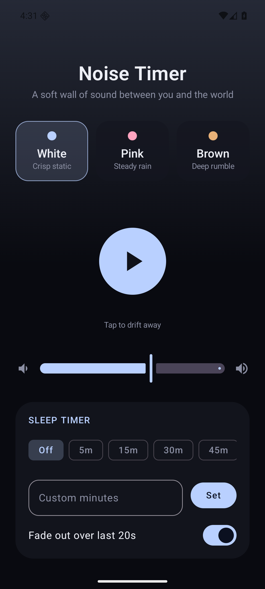
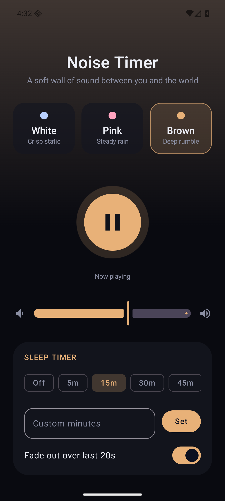

# Noise Timer

A small, open-source Android app that plays white / pink / brown noise
with an optional sleep timer (with fade-out) — a free alternative to the
various paid "noise + sleep timer" apps on the Play Store. No accounts,
no ads, no network access, no tracking.

<p align="center">
  
  
</p>

## Features

- White, pink, and brown noise, generated in real time (not looped
  samples, so there's no audible seam/click).
- Adjustable volume.
- Sleep timer with presets (5/15/30/45/60/90/120 minutes) or a custom
  duration, with an optional 20-second fade-out before it stops.
- Playback continues in the background via a foreground service, with
  play/pause/stop controls in the notification.
- Settings (noise type, volume, timer, fade-out) are remembered between
  launches.

## Building

This project uses the Gradle wrapper, so you don't need Gradle installed
separately — just a JDK 17+ and the Android SDK (command-line tools are
enough; `compileSdk`/`targetSdk` 37 requires a reasonably recent SDK
Manager package list).

```bash
./gradlew assembleDebug    # unsigned debug APK, installable as-is
./gradlew assembleRelease  # minified release APK
```

Output APKs land in `app/build/outputs/apk/{debug,release}/`.

The debug build is signed with the standard Android debug key, so
`app-debug.apk` can be installed directly with `adb install` or by
sideloading. The release build is unsigned by default so the project
builds out of the box on any machine/CI; see below if you want a signed
release build.

### Signing a release build (optional)

If you want a properly signed release APK (e.g. to install updates over
an existing install without uninstalling first), generate your own
keystore and point a local `keystore.properties` file at it. This file is
gitignored — it's per-developer, not checked in.

```bash
keytool -genkeypair -v -keystore /path/to/your.jks \
  -alias noisetimer -keyalg RSA -keysize 2048 -validity 10000
```

Create `keystore.properties` in the project root:

```properties
storeFile=/path/to/your.jks
storePassword=yourStorePassword
keyAlias=noisetimer
keyPassword=yourKeyPassword
```

Then `./gradlew assembleRelease` will automatically pick it up and sign
the release build.

## Releasing

Use `hack/release` from a clean, up-to-date `main` branch:

```bash
hack/release 1.0.2 "Fix timer handling and improve playback stability."
```

The script increments `versionCode`, writes the Fastlane changelog, runs the
tests, lint, and release build, then commits, tags, pushes, and publishes the
GitHub release. Approve the `release` environment deployment in GitHub Actions
to build and upload the signed APK.

While the initial F-Droid inclusion merge request is open, the script updates
that branch. After inclusion, F-Droid reads new tags through its auto-update
job, so the script does not create duplicate update merge requests. Use
`hack/release --fdroid-only VERSION` to retry only the F-Droid step.

## Architecture

- `NoiseEngine` — a singleton object that synthesizes PCM samples on a
  dedicated audio thread and streams them to an `AudioTrack` in
  `MODE_STREAM`. It owns all playback state (noise type, volume, timer,
  fade-out) as a `StateFlow`, persisted via `SharedPreferences`. It's
  independent of any Activity/Service lifecycle.
- `NoiseService` — a foreground `Service` that exists only to keep the
  process alive (with a notification) while audio is playing. It starts
  when playback starts and stops itself once `NoiseEngine` reports
  playback has stopped (including when the sleep timer finishes).
- `MainActivity` — Jetpack Compose UI. It talks to `NoiseEngine` directly
  for settings changes (noise type, volume, timer, fade-out), and only
  goes through `NoiseService` for the actual play/pause action, since
  starting/stopping the foreground service is the service's job.

## License

MIT — see [LICENSE](LICENSE).
